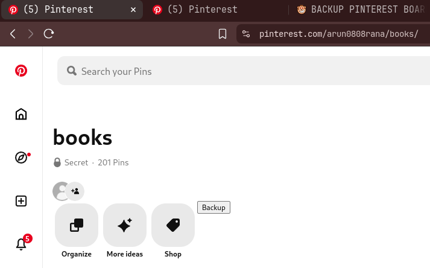

# Pinterest Boards Backup Scraper

## Introduction



- This application is divided into 2 parts - the server daemon and the violentmonkey script.
- The violenmonkey attaches a `Backup` button in the `pinterest board` pages. Clicking it will cause the script to grab all the urls for your images in that specific board.
- These links are sent to the server listening on `http://localhost:17321`. If you change the listening port of the server then make sure to change it in the violentmonkey script as well.
- The server starts the backup process of all the images of your board in the `downloads` dir.
- Remeber to make sure all the images/thumbnails are loaded in your browser before you click the `Backup` button. Remeber this button occurs on the opened-board-page of pinterest.
- Each image is saved with a incremental factor(integer) followed by the image name proposed by the target servers of pinterest.
- Even though the images that you have saved for yourself are public by origin but act as private if the board is private so you need to login
- Your login session is saved locally using `playwright` in a dir called `pinterest-session`
- You need to close the window of login once you login.
- There might be a time in future that the whole thing breaks if pinterest decides to change UI layout. You might need to address that issue. This is a common problem with scraping.

### Features

- Backups are stored in the same repo dir inside a dir name called `downloads`.
- For each `pinterest board` a new dir with the same name is created inside the `downloads` dir.
- Auto resumeability for half downloads

### Pre-requisite

- Login with your credentials for backing up private board images

```bash
npm run login
```

- Download `violentmonkey` browser extension. ~ https://github.com/violentmonkey/violentmonkey
- Create a new script and paste the `violentmonkey-script.js` file's content in this newly created script in your browser.
- In the violentmonkey script you have to replace the `/ @match       https://www.pinterest.com/arun0808rana/*` with your pinterest profile url.

### Usage

- Startup the server

```bash
npm start
```

### Todos

- Full automation for all the boards backups
- Grabing mechanism of lazy loaded DOM nodes on scrolled pages. This should happen by playwright itself. Maybe intersection API could be used or something else.
- Shift this whole thing to postgres. Introduce context awared tagging system based on ollama models for better categorization. A dedicated module will be required to re-position the files across different boards inside the `downloads` dir.
- Increase resilience against UI layout changes. Maybe AI based or UI rendering based targeting
- Introduce aria2c for parallelism/concurrency.

### Disclaimer

Scraping puts in a lot of strain on target servers and you might get banned or rate-lmiited and this is just for educational purposes. Don't abuse public images using this.
